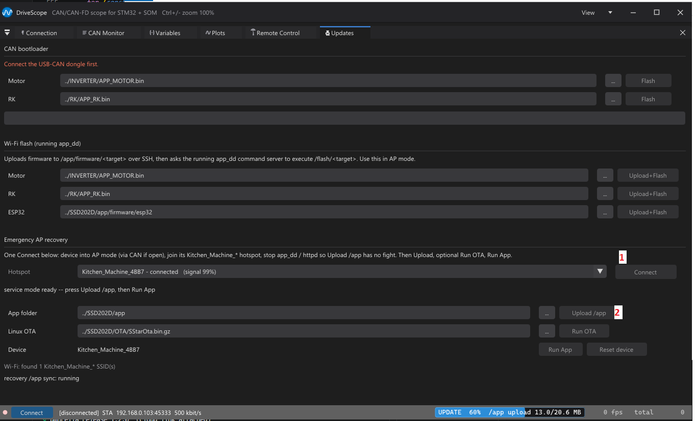
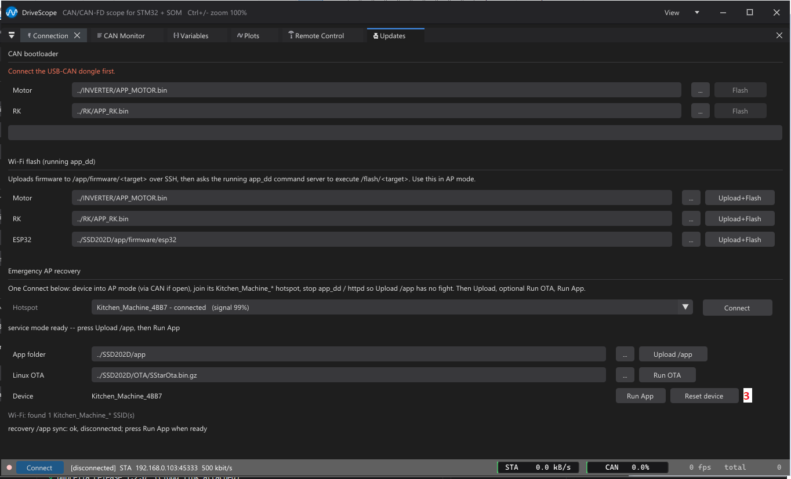

# DriveScope MVP

## Update mainPCB app

Turn on device whith mainpcb button press, when wifi is startet can unpress





## Info
Engineering MVP desktop tool for the DDV2 CAN bus.

Current target:

- WeAct USB2CANFDV1 over SLCAN/COM, tested with firmware `WeAct Studio V1.0.0.5_f655d0fb`
- SSD202D SOM Wi-Fi CAN bridge over TCP JSON lines, selected from UDP discovery, e.g. `192.168.0.102:45333`
- SSD202D Kitchen_Machine access point profile, SSID `Kitchen_Machine_<UUID>`, default `192.168.1.0:45333`
- nominal CAN 500 kbit via `S6`
- classic extended PropCAN monitor traffic
- **Unified CAN file-transfer** (single mechanism for firmware images, motor config blob, and Triggered Capture downloads — spec [docs/can-unified-file-transfer.md](../../docs/can-unified-file-transfer.md)):
  - WRITE direction `0xC0..0xCF` (host → MCU): host шлёт `HEADER_FILE [addr u32][size u32]` + блоки/mmsg/data + `FILE_FINISH [fileCrc u32]`. Motor/RK FW различают цель по `addr`: внутри app-региона flash → бутлоадерская запись (firmware update); `addr == MOTOR_CONFIG_FLASH_ADDR (0x080E0000)` → `MotorConfigScatter` (atomic config write). Та же машина состояний, тот же CRC.
  - READ direction `0xD2..0xDF` (motor → host, инициатор host): host шлёт `READ_HEADER_FILE 0xD2 [addr][size]`, motor отвечает `0xAD2` echo и стримит блок через `0xD3 READ_HEADER_BLOCK` + `0xD4 READ_HEADER_MMSG` + N×`0xD5 READ_DATA_MMSG` + `0xDF READ_FILE_FINISH [fileCrc u32]`. Размер до 16 KiB за вызов на single-shot v1. Triggered Capture downloads are not one-shot anymore: DriveScope reads the full capture with bounded `READ_CHUNK` windows (currently 1024 bytes) and verifies the MCU CRC after the whole buffer is assembled.
  - CRC32 — STM32 HW peripheral default (poly `0x04C11DB7`, init `0xFFFFFFFF`, без reflection, без final XOR). Host replay: `simple_crc32_stm32hw()` в [`command_server.cpp`](../../mainPCB/app_ssd202d_ddv2/src/command_server.cpp).
  - HTTP-обёртки в app_dd (используются DriveScope на TCP/Wi-Fi, чтобы per-chunk ACK не ходили через Wi-Fi):
    - `GET /motor/profiler?op=...` — synchronous wrapper for motor FW profiler CFG subcmd `0x04`: set limits, start no-load precheck, start locked `Rs/Ld/Lq + PI`, abort, status, and read result chunks.
    - `GET /flash/{esp32,motor,rk}` — прошивка периферии. Для motor/RK это бутлоадерский путь поверх unified WRITE `0xC0..0xCF`.
- extended PropCAN READ_MEM debug traffic: request `APP/0x0D0 dst=node src=PC(0x10)`, response `APP/0x0D1 dst=PC src=node` — **legacy**, оставлен только для live-polling одиночных переменных во вкладке Variables. Любые «прочитать пачку байт» (config, capture, region dump) идут через unified READ выше.
- Triggered Capture session control: request `APP/0x0E0`, response `APP/0x0E1`. Sub-command в `data[0]`: 0x10..0x17 для reset/set_slot/set_config/set_trigger/arm/stop/status/read_chunk; CRC sub-cmd 0x18 для end-to-end verify. Replies: 0x90 ACK, 0x95 STATUS_RSP, 0x96 CRC_RSP, 0x9F ERROR. DATA-кадры (0x97/0x98) carry the capture payload; DriveScope downloads the full buffer in bounded `READ_CHUNK` windows and checks CRC over the assembled bytes.
  - The Plots tab «Trigger» panel — UI поверх этой сессии. Мотор пишет в 32 KB ring buffer (CCMRAM), RK — в 8 KB (SRAM). Both SLCAN and TCP/Wi-Fi drive the capture session over the active CAN transport's direct state machine. (Separately, app_dd **does** expose a LAN-safe `/capture` HTTP endpoint — see `command_server.cpp` and [docs/can-unified-file-transfer.md](../../docs/can-unified-file-transfer.md) — used by host scripts such as `can-loss-localize.ps1`; it is not required for the DriveScope GUI capture path.)
  - Captured samples are anchored to the MCU's wall-clock `Done` instant — they refine the live trace at the historical trigger moment instead of tacking on at "now after ReadChunk finished". Live polling on the same node keeps running throughout the session.
- end-to-end integrity for capture: after the full buffer is downloaded in bounded windows, pc_tool sends `CAP_SUB_CRC = 0x18`; MCU walks the linearised valid-window buffer and replies `CAP_ANS_CRC = 0x96 [crc_le32, totalBytes_le16, 0xFF]`. Pc_tool verifies its own CRC32 over the byte-identical buffer (`captureCrc32` matches motor/RK `capCmdCrc()` lockstep). On mismatch — full re-pull (bounded by `crcAttemptsLeft = 4`).

Build from umbrella root:

```powershell
cmake -S tools/pc-tool -B build/pc-tool
cmake --build build/pc-tool --config Debug
```

Run GUI with a connection/watch config:

```powershell
build/pc-tool/drivescope.exe --config tools/pc-tool/config/drivescope_wifi_debug.json
```

Portable GUI launch:

```powershell
tools/pc-tool/dist/DriveScope.exe
```

On normal launch DriveScope loads `drivescope_scenario.json` from the same folder as the exe. If it is missing, the tool creates it from the bundled Wi-Fi debug config. Connection settings and the Watch/Plot table are autosaved back into that single scenario file.

Run console capture/API mode:

```powershell
build/pc-tool/drivescope.exe --capture tools/pc-tool/config/drivescope_wifi_debug.json --duration 10 --out build/pc-tool/capture.csv
```

Export symbols:

```powershell
python -m pip install pyelftools
python tools/elf_export.py MOTOR/app_stm32f4_motor/Debug/app_stm32f4_motor.elf symbols.json
```

The `Variables` tab can run the same exporter from the UI with `Export ELF + Load`.

Wi-Fi CAN without USB-CAN stick:

1. Deploy/run `app_ssd202d_ddv2` on SSD202D.
2. Open DriveScope.
3. In `Connection`, select `Wifi STA`.
4. Wait for a `Kitchen_Machine_*` discovery row, then `Connect`.
5. `CAN Monitor` shows raw and parsed traffic. Variables/plots use the same TCP link and send READ_MEM frames through the SOM.

Remote Control / diagnostic mode:

- `Remote Control` contains Wi-Fi mode buttons, mainPCB diag handover, motor controls, PFC controls, RK test controls, and minimal motor telemetry. The FOC theta calibration UI moved out of this tab into `Calibration` (Test 1).
- Motor speed slider sends `MAIN_CMD_MOTOR_PROXY/SET_SPEED` automatically while dragging, rate-limited to 10 Hz.
- PFC is blocked while motor FSM is RUN/PARKING unless the operator clears the safety checkbox; override is visible in CAN as `MAIN_CMD_PFC_PROXY.override_safety=1`.
- `CAN Monitor` decodes the new diag/PFC frames both as one-line names and as byte/bit tooltip tables, including the full bootloader file-transfer protocol (`0x0C0..0x0CF`, `0xAC0..0xACF`, `0xB00`/`0xB01` mode-switch, `0xFFF`/`0x0FF` ping with version dotted-quad). Bootloader frames are matched by `mod==0` (M-bit) so the same 0xC?/0xAC? code space doesn't collide with app-mode telemetry.
- A new "Node state (BOOT vs APP) — sniffed from CAN frames" panel sits between the Wi-Fi block and the Motor/RK tabs. Per-node it shows: the live mode pill (`APP` green / `BOOT` orange / `STALE` grey, with last-frame age), the boot+app firmware versions parsed from the last ping reply (dotted-quad `M.m.p.b` rendered in the canonical big-endian-uint32 order — firmware stores the version as a `uint32_t` literal and `memcpy`s it on a little-endian core, so byte 3 of the payload is the major), and four buttons: `Ping (app)` (mod=APP cmd `0x0FF`), `Ping (boot)` (mod=BOOT cmd `0xFFF`), `Go to BOOT` (mod=APP cmd `0x001`, magic `0xCC×4 0xDD×4`, only enabled in APP), `Go to APP` (mod=BOOT cmd `0xB01`, only enabled in BOOT). After every Go-to-Boot/Go-to-App pc_tool auto-pings the same node 300 ms later in the new mode so the indicator flips without a manual click — useful when a flash leaves the MCU stuck in boot and you want to see the new state before firing the next attempt.
- READ_MEM polling for any watch on a node currently observed in BOOT mode is automatically suppressed (`valueText = "node in BOOT"`), so a flash isn't drowned by unanswered reads from the live `Variables` tab. The suppression auto-clears as soon as an APP-mode frame is seen from the node, or after ~8 s of total silence on that source.

Updates:

- `Updates` keeps direct CAN bootloader flashing for Motor/RK on the USB-CAN/SLCAN dongle path — this is the **unified WRITE side** (`0xC0..0xCF` wire codes, spec [docs/can-unified-file-transfer.md](../../docs/can-unified-file-transfer.md)) talking to the MCU's bootloader directly. Works without mainPCB if the dongle is connected to the target CAN bus.
- In AP/STA mode, use `Wi-Fi flash (running app_dd)`: DriveScope uploads Motor/RK/ESP32 firmware to `/app/firmware/<target>/` with Bitvise SFTP and then calls app_dd's loopback command server endpoint `/flash/<target>`. App_dd performs the same unified WRITE locally over CAN (same wire codes, same CRC), so per-chunk ACK roundtrips never traverse Wi-Fi.
- ESP32 firmware is Wi-Fi-only from DriveScope (no CAN path — ESP32 sits on UART) and expects the four-file bundle: `bootloader.bin`, `ota_data_initial.bin`, `partitions.bin`, and `firmware.bin`.
- `Emergency AP recovery` in the same tab can join a visible `Kitchen_Machine_*` hotspot, upload the release `SSD202D/app` folder, or run the release `SSD202D/OTA/SStarOta.bin.gz` Linux OTA on `192.168.1.0` without opening the TCP CAN bridge or requiring `app_dd` to be running. It uses SFTP for payloads, HTTP `:8080` for the temporary recovery CGI, and provides a `Reset device` button after upload/OTA.
- The release scenario stores update paths relative to the `DriveScope/` folder: `../INVERTER/APP_MOTOR.bin`, `../RK/APP_RK.bin`, `../SSD202D/app/firmware/esp32`, `../SSD202D/app`, and `../SSD202D/OTA/SStarOta.bin.gz`. Operators can still browse to another file; the edited path is saved back to the scenario.

Calibration:

- The `Calibration` tab (between `Remote Control` and `Motor Config`) is the home of all motor calibration work. Layout per [docs/calibration-tab-redesign.md](docs/calibration-tab-redesign.md): a left rail of sub-sections, a compact always-visible motor-config strip, a per-section content pane, and a docked transaction log under the rail.
- Sections: `Overview` (connection / diag / fault dashboard + test checklist), `Test 1 - Theta` (FOC electrical-angle calibration, migrated from Remote Control: 7-row LUT + sector dial), `Test 2 - Machine params` (the motor profiler, migrated from Motor Config: Rs/Ld/Lq auto-ID with datasheet pass/fail bands), `Test 3 - PI + step` (live current/speed-loop PI gain editing with range sliders + `Compute from Test 2`), `Test 4 - Inertia` (manual J/B/lambda entry + a `lambda_pm` estimator), and `Config (full)` (the everyday dense config editor).
- Every editable field uses an INAV-style range slider + numeric entry + `Set`, with units, datasheet spec, the live motor value, and a per-field sync chip (`edited` → `sent` → `ACK` → `ok`). All writes go to motor RAM via the whole-config blob; `Save to flash` is always explicit and gated on motor idle.
- The transaction log records every calibration TX frame and every `0x0AB`/`0x0AC` RX frame, so the operator sees what was sent and what was ACKed.
- Step-response acquisition (Test 3) and the coast-down J/B fit (Test 4 Tier A) reuse the Triggered Capture pipeline; the `Run step test` / `Run coast-down` buttons are currently disabled with a tooltip — arm the capture from the Plots tab meanwhile. Test 4 Tier B (`Run J/B identification`) is disabled pending motor FW roadmap Phase 6.

Motor Config / Profiler:

- `Motor Config` is kept as the raw param-table escape hatch (DIAG counters, `cfg.fw_ver`/`cfg.crc`, power-user view). The everyday config editor and the profiler now live in the `Calibration` tab.
- Reference values for TI086-056-080: `Rs ~= 14.05 Ohm`, `Ld/Lq ~= 25.23 mH` (named `constexpr` in `src/ui/CalibMeta.h`). The firmware applies computed current-loop PI gains in RAM; persistence remains an explicit `SAVE_ALL`.
- Profiler start buttons require mainPCB diagnostic handover so the regular mainPCB motor commands stay quiet during the inverter test.

Kitchen_Machine AP mode:

1. Connect Windows to the `Kitchen_Machine_<UUID>` access point.
2. In `Connection`, select `WiFi AP`.
3. Use the default `192.168.1.0:45333`, then `Connect`.

Config files:

- `tools/pc-tool/config/drivescope_wifi_debug.json` enables TCP SOM only and plots motor phase currents plus RK bracket angle.
- In `Wifi STA`, the saved `tcp.host` is not used for Connect when discovery has a visible device; DriveScope copies the selected discovery IP into the TCP target just before opening the socket.
- `tools/pc-tool/config/drivescope_slcan_debug.json` keeps SLCAN settings separate for the USB-CAN stick.
- `tools/pc-tool/config/drivescope_tcp_protocol_probe.json` and `drivescope_slcan_protocol_probe.json` are quick READ_MEM smoke tests for destination nodes 1/2/3 plus the current ESP32 node-4 placeholder.
- `tools/pc-tool/dist/drivescope_scenario.json` is the portable customer scenario; keep it next to `DriveScope.exe` and the `symbols/` folder.

## CAN sniffer (JSONL)

DriveScope can log every CAN frame it already sends/receives to a JSONL file —
a passive tap on the existing TX (`sendFrameThreadSafe`) and RX (`handleFrame`)
paths. This is **application-level sniffing of the frames flowing through
DriveScope's own transport** (SLCAN serial or the TCP CAN bridge over Wi-Fi) —
it is **NOT** a raw 802.11 / WiFi monitor mode and needs no special adapter.

Enable it by pointing an env var at a file (default: off, zero overhead):

```powershell
# PowerShell — log this session's frames, then launch DriveScope
$env:DRIVESCOPE_SNIFF_JSONL = "C:\temp\ddv2_sniff.jsonl"
.\DriveScope.exe
```

```bash
# bash
DRIVESCOPE_SNIFF_JSONL=/tmp/ddv2_sniff.jsonl ./drivescope
```

One JSON object per line, appended live (flushed per frame so a crash still
leaves a complete log):

```json
{"ts":12.345678,"dir":"rx","transport":"tcp","id":"0x10A30102","ext":true,"len":8,"data":"0200007A44FFFFFF","decoded":"MTR RPM mode=2 rpm=1000.0"}
```

Fields: `ts` (s since launch), `dir` (`tx`/`rx`), `transport`
(`tcp`/`slcan`/`wifi_ap`/`manual`), `id` (29-bit PropCAN ext id), `ext`, `len`
(payload bytes), `data` (hex), `decoded` (human text from the existing
`CanDecoder` — the sniffer does not re-implement protocol decoding). Unknown or
malformed frames are logged too. To turn it off, unset the env var.
